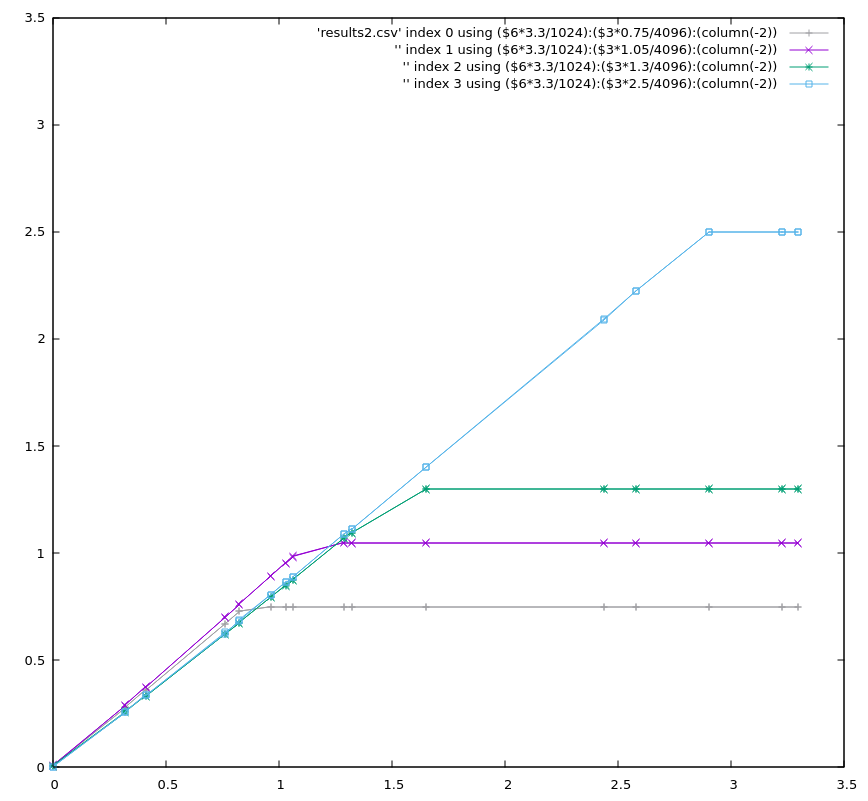

The `micropython` `ADC.read_u16()` function returns [0-65535] for a/d values, against the voltage reference.  For most implementations the reference is 3.3V, but for the `esp32c3` the max voltage depends on attenuation:

- `atten=0` is 0.75V
- `atten=1` is 1.05V
- `atten=2` is 1.3V
- `atten=3` is 2.5V

Using a XIAO SAMD21 to generate voltages in the range [0,3.3V] mapped to range [0,1023] (10-bit resolution) the voltages at the XIAO ESP32C3 were looked at using `ADC,read()` which returns values in [0,4095] (12-bit a/d).

Shows the received voltage per generate voltate for the 4 attenuation values.
